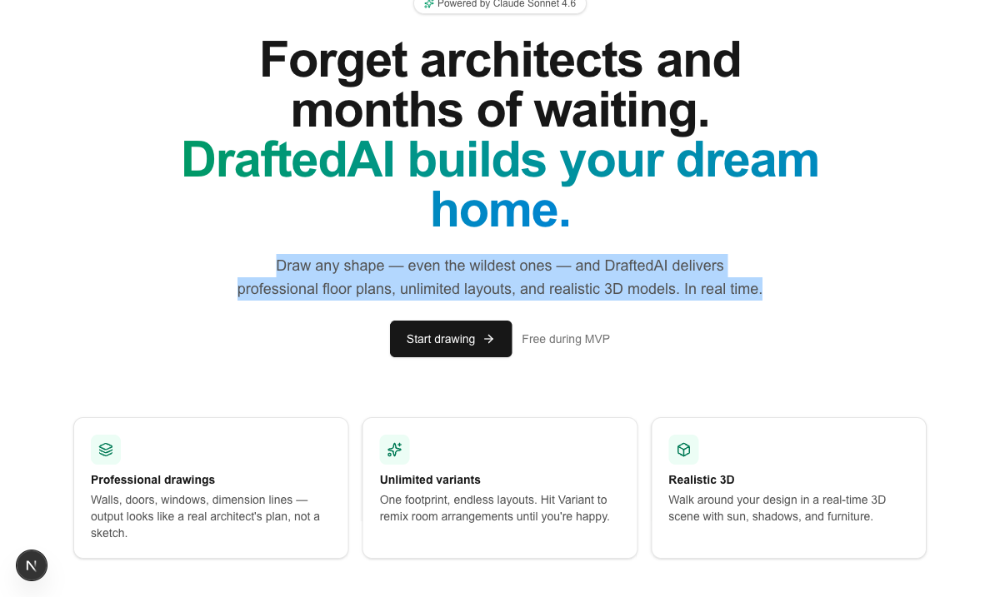
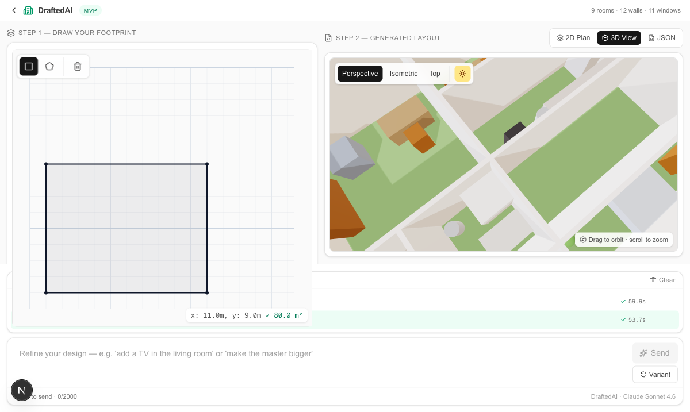
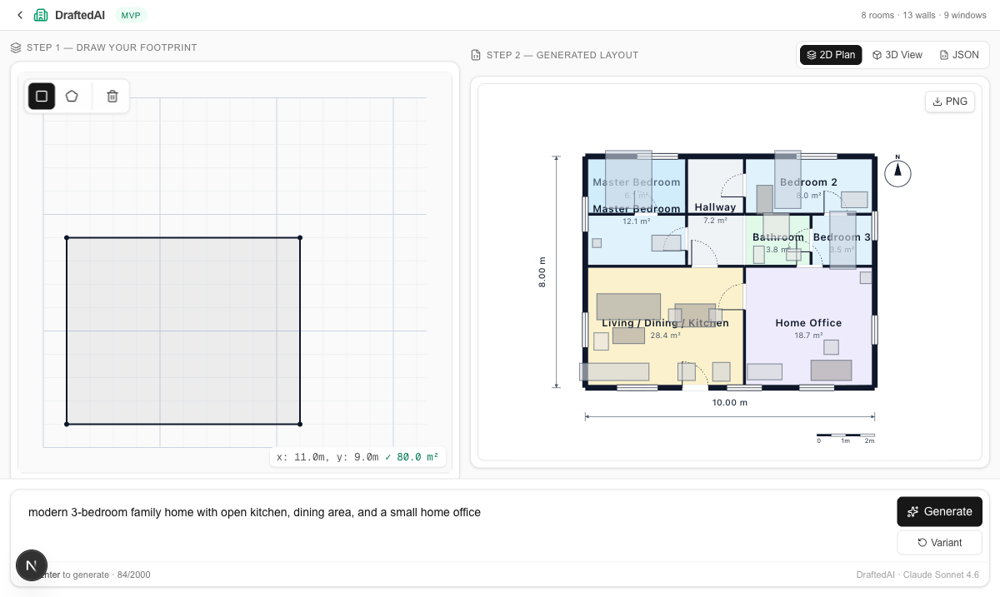
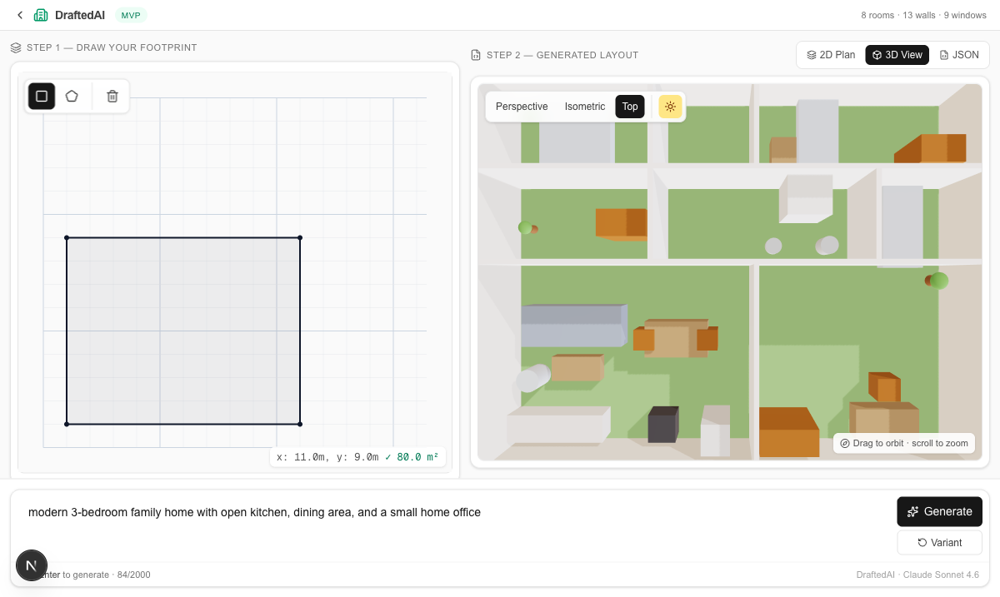

# DraftedAI

> **Draw any shape, describe a home, ship a layout.**
> A conversational AI architectural design tool. Sketch a building footprint, talk to Claude about how you want to live in it, and watch a real floor plan + 3D model emerge — then iterate, branch, compare, and critique like a real designer.



---

## What this is

Most AI floor-plan tools generate one drawing from a prompt and stop. DraftedAI is built around the **iterative loop a designer actually works in**: sketch → describe → generate → refine → branch → critique → re-render.

Every conversation is a **project** with its own URL. Every edit is a **versioned turn** in a persistent history. Every layout knows the footprint it was born for, so changing the shape never silently destroys earlier work.

| Studio | 2D plan | 3D scene |
| --- | --- | --- |
|  |  |  |

---

## Features

### 🎨 Drawing & generation
- **Konva-powered canvas** — rectangle and polygon tools with snap-to-grid, live dimensions, and instant area readout in m².
- **Streaming AI generation** — Claude Sonnet 4.6 with `tool_use`-validated structured output. You see room placements stream in in real time.
- **Polished 2D floor plan** — walls, door swing arcs, window glazing, room labels with area, dimension lines, scale bar, north arrow, PNG export.
- **3D scene** — React Three Fiber with extruded walls, furniture, sky, sun shadows, and perspective / isometric / top-down camera modes.

### 💬 Conversational design (the heart of the tool)
- **Project workspaces** — each conversation is a `/draft/[id]` URL backed by SQLite. Reload, share, come back tomorrow.
- **Multi-turn editing** — every follow-up uses Anthropic's proper `tool_use` / `tool_result` threading; Claude sees the full conversation and applies changes as edits, not regenerations.
- **Branching via edit** — click ✏️ on any past turn to fork from that point.
- **Compare versions** — pick any two completed turns, view side-by-side 2D / 3D / JSON, with a structural diff (`+1 room: Billiards`, `−2 windows`, `Living: 24m² → 18m²`).
- **Stale-version handling** — change the footprint and old turns are *kept* (not deleted), flagged stale, and excluded from new context. No data loss, ever.

### 🏛️ Designer power-tools
- **📌 Project rules** — pin must-include / must-avoid constraints (e.g. *"Always include a covered patio"*, *"No bedroom on the entry side"*). Pinned rules are injected into every prompt and respected across turns.
- **🌞 Day-in-the-Life walkthrough** — AI writes a 4-paragraph narrative anchored in *Morning / Midday / Evening / Night*, in the language of your room names, ready to drop into a client deck.
- **🩺 Architectural critique** — structured review with score `/10`, overall verdict, and prioritised issues (high / medium / low) covering circulation, daylight, privacy, adjacencies, buildability, and clearances. Each issue has a one-click **Apply fix** button that drops a refinement prompt into the chat.

---

## Quick start

```bash
git clone https://github.com/<you>/draft-ai.git
cd draft-ai
npm install

# Add your Anthropic API key
cp .env.local.example .env.local
# edit .env.local → ANTHROPIC_API_KEY=sk-ant-...

npm run dev
```

Open <http://localhost:3000>. Click **New project** → draw a rectangle → describe your home → hit **Generate**.

### Scripts

| Command | What it does |
| --- | --- |
| `npm run dev` | Start the Next.js dev server (Turbopack). |
| `npm run build` | Production build. |
| `npm run typecheck` | Strict TypeScript check. |
| `npm run lint` | ESLint with React 19 rules. |
| `npm test` | Run vitest unit tests. |

---

## Tech stack

| Layer | Choice | Why |
| --- | --- | --- |
| Framework | **Next.js 16** (App Router, Turbopack) | Streaming SSE for AI responses, server actions, modern build pipeline. |
| UI | **React 19** + **Tailwind CSS 4** + lucide-react | Server components where possible, strict React Compiler rules. |
| Drawing | **Konva** + react-konva | Imperative canvas without leaving React. |
| 3D | **Three.js** + **React Three Fiber** + **drei** | Declarative 3D, free realistic-ish lighting via `<Environment>`. |
| AI | **Anthropic Claude Sonnet 4.6** | Tool-use structured output, streaming `input_json_delta`, prompt caching on the long system prompt. |
| Schemas | **Zod 4** | Single source of truth — runtime validation **and** generated JSON Schema for the Claude tool. |
| Persistence | **SQLite** via `node:sqlite` (Node 24 built-in) | Zero-deps, local-first, WAL mode. |
| Tests | **vitest** | Geometry utilities are unit-tested. |

---

## Architecture

```
┌────────────────────────────────────────────────────────┐
│  Browser (/draft/[id])                                 │
│  ┌──────────────┬───────────────────────────────────┐  │
│  │ DrawingCanvas│ 2D Plan / 3D View / JSON / Compare│  │
│  │  (Konva)     │ Walkthrough · Critique overlays   │  │
│  └──────────────┴───────────────────────────────────┘  │
│  Pinned rules · Conversation · Prompt input            │
└──────────────────────┬─────────────────────────────────┘
                       │ REST + SSE
                       ▼
┌────────────────────────────────────────────────────────┐
│  Next.js API routes (Node runtime)                     │
│  /api/projects (CRUD)                                  │
│  /api/projects/[id]/generate   (streaming, persistent) │
│  /api/projects/[id]/turns/[turnId]/walkthrough         │
│  /api/projects/[id]/turns/[turnId]/critique            │
└──────────────┬─────────────────────────┬───────────────┘
               │                         │
               ▼                         ▼
        Anthropic Claude          SQLite (node:sqlite)
        (tool_use, streaming,     projects(footprint, pins)
         prompt caching)          turns(layout, status, idx)
```

### Key files

```
src/
├── app/
│   ├── page.tsx                            ← Landing
│   ├── draft/page.tsx                      ← Projects index
│   ├── draft/[id]/page.tsx                 ← Studio
│   └── api/projects/...                    ← REST + SSE
├── components/draft/
│   ├── DrawingCanvas.tsx                   ← Konva sketcher
│   ├── FloorPlan2D.tsx                     ← SVG technical drawing
│   ├── Scene3D.tsx                         ← React Three Fiber scene
│   ├── ConversationPanel.tsx               ← Chat history + input
│   ├── PinnedDecisions.tsx                 ← Must-include / avoid chips
│   └── DesignerActions.tsx                 ← Walkthrough + Critique overlays
├── hooks/useProject.ts                     ← Server-backed conversation state
├── lib/
│   ├── schema.ts                           ← Zod schemas (single source of truth)
│   ├── db.ts                               ← node:sqlite repos
│   ├── claude.ts                           ← SDK + tool definitions
│   ├── prompts.ts                          ← System + user prompt builders
│   ├── geometry.ts                         ← Polygon utilities
│   └── diff.ts                             ← Layout-vs-layout diff
```

---

## Roadmap (designer-first)

These are next on the list, in order of expected impact:

1. **Adjacency bubble diagram** — drag-and-drop room relationships before generation.
2. **Direct-manipulation refinement** — drag walls in 2D, AI re-validates and proposes fixes.
3. **Auto design brief export** — one click → polished Markdown / PDF for handing to clients.
4. **Sun path animation in 3D** — solstice / equinox arcs to verify orientation claims.
5. **Site context inputs** — orientation, road, view, neighbour chips that inform AI placement.
6. **Story Mode** — write a short scene about life in the home; AI extracts spatial requirements from the narrative.
7. **Reviewer personas** — critique lensed through Tadao Ando, Frank Lloyd Wright, etc.
8. **Client share link** — read-only URL with per-turn comments.

Explicitly **not** on the roadmap (yet): multi-floor, photorealistic rendering, BIM/IFC export.

---

## License

MIT — see `LICENSE` if present, otherwise treat as MIT for now.

> _Built as an MVP to explore what AI-native architectural design tooling could feel like. Not affiliated with any architecture firm or building authority. Generated layouts are conceptual — get a real engineer before pouring concrete._
